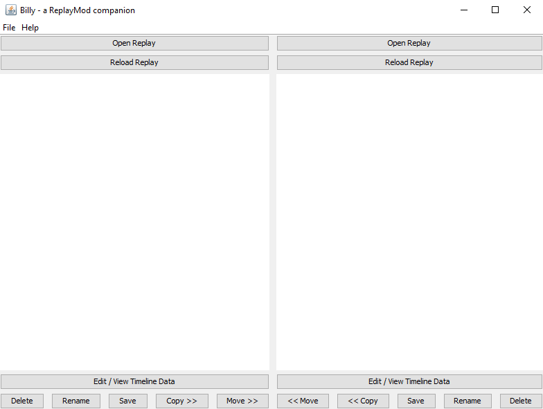
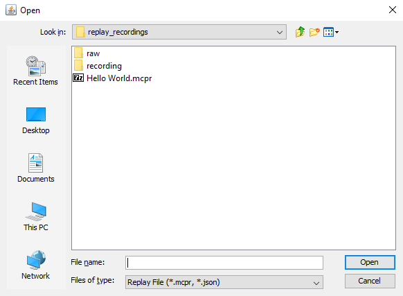
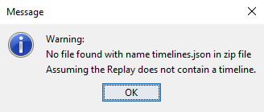
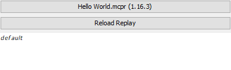
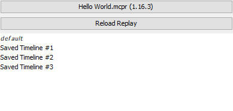
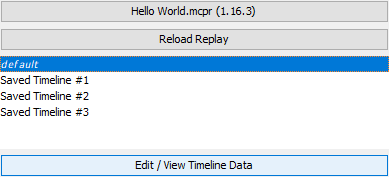
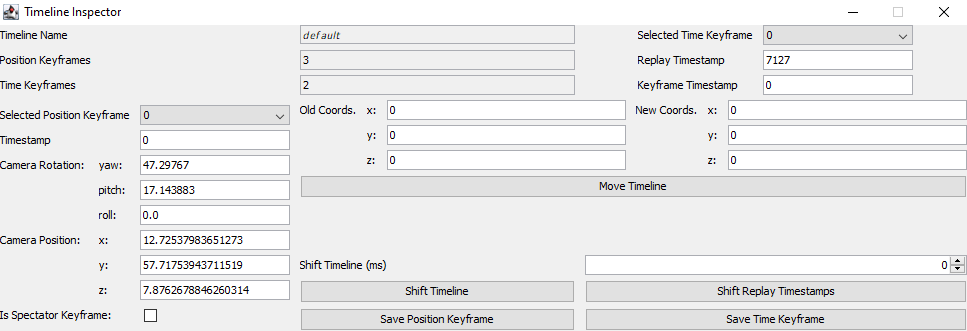
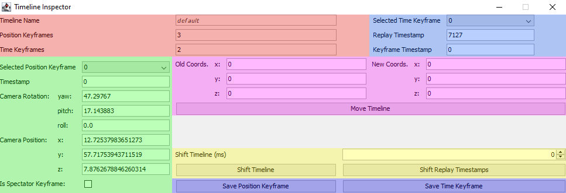

# Billy - a ReplayMod companion

Be careful, Billy is powerful but bugs can appear, make sure to backup your Replay.
I will try to make this readme as clear as possible, for new users.

## Main Interface

That one will look odd for newcomers, but this is Billy's main interface (yes there is another one, but we'll look at it later):

As you can see, there are plenty of things that Billy can do. Let's start with the first function: opening a Replay.

## Opening a Replay

To open a Replay, simply click on the `Open Replay` button, but you might ask on which side should you open your Replay? I'd recommend opening it on the left side, but you're free to also open it on the right side if you want.

You'll see a windows like this appear after clicking the button:

Select your Replay and click `Open`, if your Replay has no timelines, this message will appear:

For this doc, I will use the `Hello World.mcpr` Replay. After opening the Replay, the name of the `Open Replay` will change to have the following format: `<Replay Name> (<Version>)`.

- `<Replay Name>` is well, the Replay name
- `<Version>` is the Minecraft version in which you recorded the Replay

For me, it looks like that: `Hello World.mcpr (1.16.3)`

After opening a Replay, if it has a timeline, it'll show one as `default`, it's the one that is loaded by default by the ReplayMod.

If you saved multiple timelines using the ReplayMod's Keyframe Repository, they will all show with their name on the interface:

## Editing the timelines

Before going with the real stuff, if you accidentally deleted, renamed, or edited a timeline, click the `Reload Replay` to reload it. If you saved the Replay before reloading, you cannot recover what you deleted/modified.

You might notice that at the bottom of each side, there are 6 buttons: `Edit / View Timeline Data`, `Delete`, `Rename`, `Save`, `Copy` and finally `Move`.

Let's start with the first 3 small buttons:

All the following buttons **require** at least one timeline to be selected.
- `Delete`: You can click this button to delete the selected timeline, if multiple timelines are selected, they will all be deleted.
- `Rename`: You can click this button to rename the selected timeline, if multiple timelines are selected, they will all be renamed (of course you can choose a name for each one).
- `Save`: You can click this button to save the Replay.
- `Copy`: You can click this button to copy the selected timeline to the other side, if multiple timelines are selected, they will all be copied.
- `Move`: You can click this button to move the selected timeline to the other side, if multiple timelines are selected, they will all be moved. 

Both the `Copy` and `Move` buttons **require** a Replay to be opened in the other side.

## Edit / View Timeline Data

Now, let's talk about the `Edit / View Timeline Data` button. This time, you have to select only one timeline (only one timeline can be edited at a time). After selecting the timeline, simply click the button to edit it.

A giant window like the following one will appear, but don't worry, we'll tame it together.

Below is how the components are arranged. I will describe what color do what below.

Here's the colors and their functions:
- Red: Timeline infos (name, amount of position & time keyframes)
- Light Blue: Time keyframe data & combo to select a keyframe (`0` by default)
- Green: Position keyframe data & combo to select a keyframe (`0` by default)
- Magenta: Timeline mover (we will talk about it later)
- Yellow: Timeline shifter (we will also talk about it later)
- Dark blue: Save keyframe buttons

### Editing Position and Time Keyframe

Editing a keyframe is as simple as selecting it via the combo, and changing the values in the inputs. Don't forget to press the associated save button before changing keyframe!

### Moving Timeline

Imagine you've made a really cool timelapse of you building something, but then you noticed the camera path is off by a few blocks, well this move function will allow you to fix that problem!
You can put in the `Old Coords.` inputs the coordinates of one position keyframe, and in the `New Coords.` inputs, the new position of that position keyframe.

If you know by how much you need to move your timeline, simply edit the `New Coords.` inputs.

After you're done that, press `Move Timeline`.

### Shifting Timeline

That one is also very useful, let's say you made your camera path, but forgot to show something at the start, instead of moving the keyframes by hand, simply tell Billy by how many milli-seconds (1 second = 1000ms) you need the timeline to be shifted.
The number can be positive or negative, but make sure you ***do not*** have a negative timestamp in your keyframes.

That's basically it for the Timeline Inspector. See? Very simple.